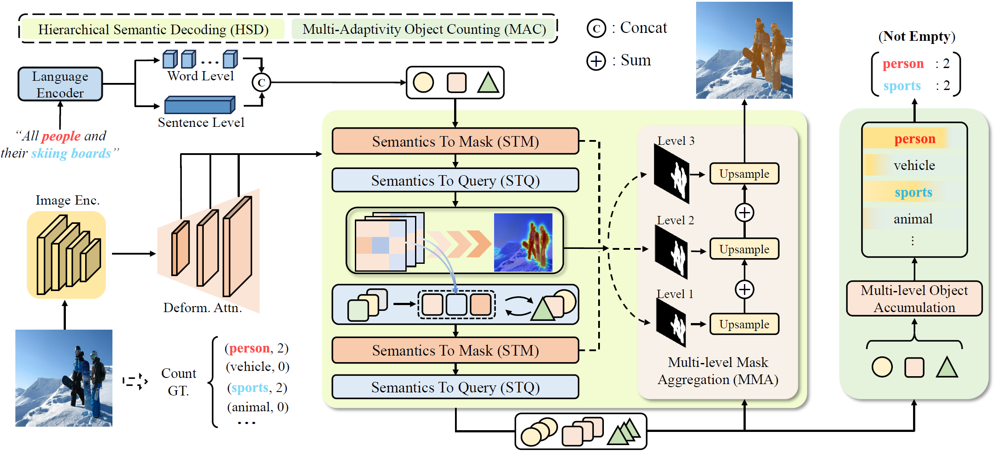
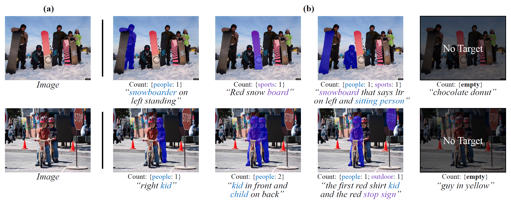

# ✂HDC: Hierarchical Semantic Decoding with Counting🔢 Assistance for Generalized Referring Expression Segmentation

[Zhuoyan Luo*](https://robertluo1.github.io/), [Yinghao Wu*](https://scholar.google.com/citations?user=lg9s6u8AAAAJ&hl=en), [Yong Liu](https://workforai.github.io/), [Yicheng Xiao](https://easonxiao-888.github.io/), [Xiao-Ping Zhang](https://sites.google.com/view/xiaopingzhang/home), [Yujiu Yang](https://scholar.google.com.hk/citations?user=4gH3sxsAAAAJ&hl=th)

Tsinghua University

## 🔥 Updates

- [2024/05/27] The code is coming soon.

## 📖 Abstract
The newly proposed Generalized Referring Expression Segmentation (GRES) amplifies
the formulation of classic RES by involving multiple/non-target scenarios.
Recent approaches focus on optimizing the last modality-fused feature which is
directly utilized for segmentation and object-existence identification. However,
the attempt to integrate all-grained information into a single joint representation is
impractical in GRES due to the increased complexity of the spatial relationships
among instances and deceptive text descriptions. Furthermore, the subsequent
binary target justification across all referent scenarios fails to specify their inherent
differences, leading to ambiguity in object understanding. To address the weakness,
we propose a Hierarchical Semantic Decoding with Counting Assistance framework
(HDC). It hierarchically transfers complementary modality information across
granularities, and then aggregates each well-aligned semantic correspondence for
multi-level decoding. Moreover, with complete semantic context modeling, we
endow HDC with explicit counting capability to facilitate comprehensive object
perception in multiple/single/non-target settings. Experimental results on gRefCOCO,
Ref-ZOM, R-RefCOCO, and RefCOCO benchmarks demonstrate the
effectiveness and rationality of HDC which outperforms the state-of-the-art GRES
methods by a remarkable margin. 

## 📗 FrameWork

## 🍺 Visualizations
<tr>

</tr>

## ❤️ Acknowledgement
Code in this repository is built upon several public repositories. Thanks for the wonderful work [ReLA](https://github.com/henghuiding/ReLA)! !

